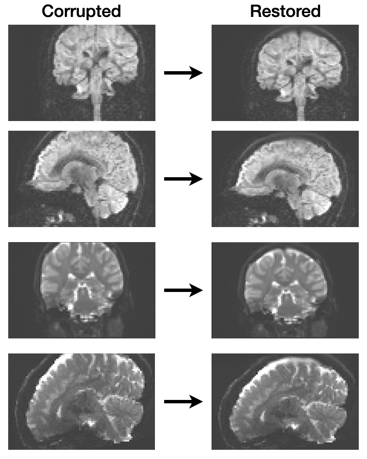

# Inpainting Croppped Diffusion MRI using Deep Generative Models

Code used for the analysis in Ayub et al. 2020, "Inpainting Cropped Diffusion MRI using Deep Generative Models"

Cropping artifacts can occur in MRI scans and neuroimaging data when the subject is poorly positioned in the scanner or the field-of-view does not contain entire head. This tends to occur in developmental studies where head size changes with age in the same subjects and the field-of-view from baseline scans becomes suboptimal. Having missing parts of the skull, even worse the brain itself, can be problematic for subsequent preprocessing steps such as aligning subjectt images within the same group or multiple scans of the same subject. Also, missing data is detrimental for group analyses.

Here, we reconstruct the missing data using generative models, specifically variational autoencoders and GANs. The `vqvae.ipynb` Jupyter Notebook contains code for training the variational autoencoder models. The `vaegan.ipynb` Jupyter Notebook contains code for training the GAN models.
